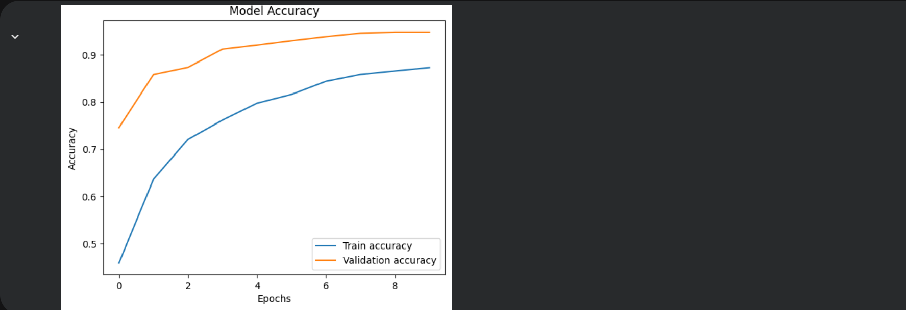
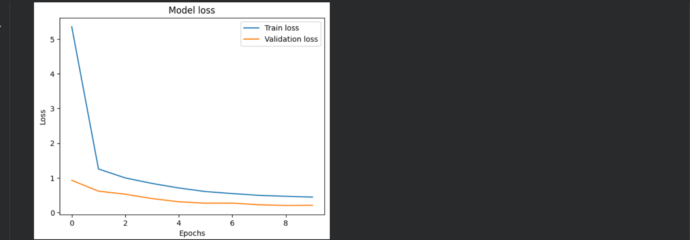
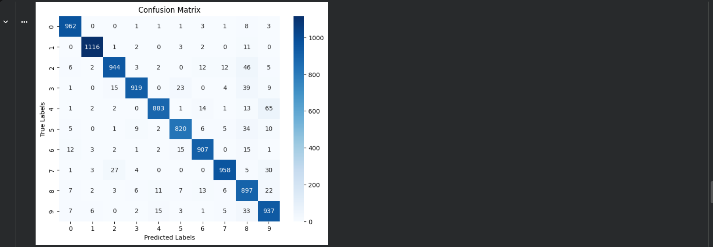
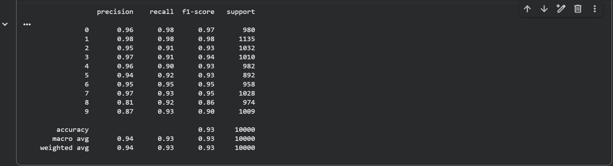

# Deep_Learning
# MNIST Handwritten Digit Classification using Artificial Neural Networks
## Project Overview
This project demonstrates how to build and deploy an **Artificial Neural Network (ANN)** using **TensorFlow/Keras** to classify handwritten digits from the MNIST dataset.
The model is trained to recognize digits **0–9** from grayscale images. Each image has a resolution of **28×28 pixels**. The project covers the complete deep learning workflow including **data preprocessing, model development, training, evaluation, visualization, and model saving**.
This project was developed as part of the **Cyber Shujaa Data & Artificial Intelligence Program** to demonstrate practical skills in **deep learning and model deployment workflows**.

## Objectives
The main objectives of this project were to:
* Load and explore the MNIST dataset
* Preprocess image data for neural network training
* Build an ANN model using the Keras Sequential API
* Train and validate the model
* Evaluate model performance using test data
* Visualize model training history
* Generate a confusion matrix and classification report
* Save and reload the trained model using the modern Keras format

## Dataset Description

| Feature      | Description                                                     |
| ------------ | --------------------------------------------------------------- |
| Dataset      | MNIST (Modified National Institute of Standards and Technology) |
| Total Images | 70,000                                                          |
| Training Set | 60,000                                                          |
| Test Set     | 10,000                                                          |
| Image Size   | 28 × 28 pixels                                                  |
| Classes      | Digits 0–9                                                      |

The dataset is widely used as a **benchmark dataset in machine learning and deep learning research**.

## Technologies Used

* **Python**
* **TensorFlow / Keras**
* **NumPy**
* **Matplotlib**
* **Seaborn**
* **Scikit-learn**
* **Google Colab**

## Model Architecture

The model was implemented using the **Keras Sequential API** with the following layers:

| Layer         | Description                                |
| ------------- | ------------------------------------------ |
| Flatten       | Converts 28×28 image into a 1D vector      |
| Dense (128)   | Fully connected layer with ReLU activation |
| Dropout (0.3) | Prevents overfitting                       |
| Dense (64)    | Hidden layer with ReLU activation          |
| Dropout (0.3) | Regularization                             |
| Dense (10)    | Output layer with Softmax activation       |

### Model Configuration
* **Optimizer:** Adam
* **Loss Function:** Categorical Crossentropy
* **Evaluation Metric:** Accuracy
* **Epochs:** 10
* **Batch Size:** 128

## Model Performance

After training the neural network for 10 epochs, the model achieved approximately:

**Test Accuracy:** ~97–98%

The model demonstrates strong performance in recognizing handwritten digits from the MNIST dataset.

---

## Training Visualization

### Model Accuracy
This plot shows how the model's accuracy improved during training while monitoring validation performance.



### Model Loss
Loss decreases over time as the model learns the patterns in the training data.



## Confusion Matrix
The confusion matrix shows the number of correct and incorrect predictions for each digit class. Most digits are correctly classified, indicating strong model performance.



## Classification Report
The classification report summarizes the model performance.



## Classification Report

The classification report provides detailed metrics including:
* **Precision**
* **Recall**
* **F1-Score**

These metrics measure how accurately the model predicts each digit class.


## Model Saving

The trained model is saved using the **modern Keras format**:

```python
model.save("mnist_ann_model.keras")
```

Saving the model allows it to be reused for predictions without retraining.

---

## ▶️ How to Run the Project

### 1️⃣ Clone the Repository

```bash
git clone https://github.com/yourusername/mnist-ann-classifier.git
cd mnist-ann-classifier
```

### 2️⃣ Install Dependencies

```bash
pip install tensorflow numpy matplotlib seaborn scikit-learn
```

### 3️⃣ Run the Notebook or Script

You can run the project using:

* **Google Colab**
* **Jupyter Notebook**
* **VS Code**

## Key Skills Demonstrated

* Deep Learning Model Development
* Artificial Neural Networks (ANN)
* Image Classification
* Data Preprocessing for Images
* Model Evaluation Techniques
* Visualization of Model Performance
* Model Serialization and Reusability


## Future Improvements

Possible improvements for this project include:

* Implementing **Convolutional Neural Networks (CNNs)** for higher accuracy
* Adding **data augmentation**
* Deploying the model using **Streamlit or FastAPI**
* Converting the model to **TensorFlow Lite for mobile deployment**


